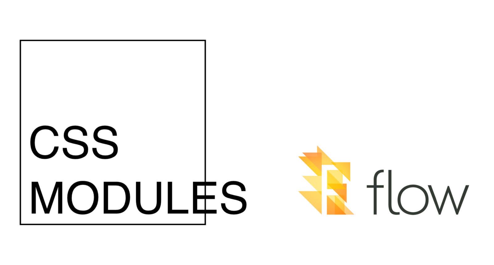

I’ve been dreaming about type safety and editor autocompletion when using [CSS Modules](https://github.com/css-modules/css-modules). There are a few TypeScript tools for this (see [this](https://medium.com/@sapegin/css-modules-with-typescript-and-webpack-6b221ebe5f10) and [this](https://github.com/Quramy/typed-css-modules)), but I didn’t find any solid tools for [Flow](https://flow.org/).

_TL;DR I’ve made some [new tools](https://github.com/skovhus/css-modules-flow-types), and when trying them on a codebase I’m working on, Flow found **a lot of dead code (and potential bugs)**_ 😬

## The problems

It is quite easy to misspell a class name or forget to update consumers after removing a class in a .css file. As an example, the class `foo` might not be defined in `Button.css`:

```javascript
/* @flow */
import styles from './Button.css';
const Button = () => <button className={styles.foo} />;
```


## Solutions

To teach Flow about CSS Modules file, we can create a definition file `Button.css.flow` containing the class names exposed by `Button.css`. By doing so we can get:

- static type checks showing usage of non existing classes
- editor autocompletion of CSS classes (for editors supporting Flow)

To generate these .flow files I was thinking of two use cases. One using a simple CLI and another using webpack.

### Solution: CLI

[css-modules-flow-types-cli](https://www.npmjs.com/package/css-modules-flow-types-cli) is a CLI that quickly generate .flow files.

Let us install it:

```
npm install --save-dev css-modules-flow-types-cli

# or

yarn install -D css-modules-flow-types-cli
```

And then just run the CLI on your source directory:

```
css-modules-flow-types src
```

I recommend using the CLI on your CI system (like Travis or Circle) to ensure that all .flow files are up-to-date before running Flow. This will catch potential styling errors before deploying.

Another use case is quick feedback loop when developing and changing CSS Modules files. The CLI includes a watch mode for this, but I myself would like to avoid having yet another tool that needs to be running while developing. As a lot of people already have webpack running, I did a small loader consuming the tokens from style-loader.

### Solution: webpack loader

[css-modules-flow-types-loader](https://www.npmjs.com/package/css-modules-flow-types-loader) is a webpack loader keeping .flow files updated by consuming the tokens from `style-loader`. I recommend using this when developing as part of a webpack-dev-server setup. It will give a small slowdown, as the loader potentially needs write a lot of files.

To get started:

```
npm install --save-dev css-modules-flow-types-loader
```

Then update your webpack config:

```javascript
{
  test: /\.css$/,  // or the file format you are using
  use: [
    'style-loader',
    'css-modules-flow-types-loader',  // right after style-loader
    // Other loaders like css-loader after this:
    ...
  ]
}
```

And then sit back and enjoy CSS Modules being type checked by Flow. 🍺

Please let me know what you think… And give a little ⭐️ over at [GitHub](https://github.com/skovhus/css-modules-flow-types).

*This blog post was originally posted on [hackernoon](https://hackernoon.com/type-safe-css-modules-with-flow-dd95e761bbe5).*
